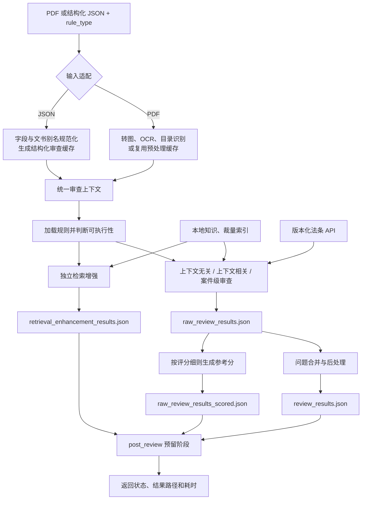

# 行政执法案卷智能审查

面向深圳市龙华区行政执法案卷的智能审查项目。系统接收 PDF 案卷或结构化
JSON 和八位 `rule_type`，依次完成输入适配、规则筛选、多范式审查、外部知识
检索、规则级评分以及结果持久化。

当前仓库提供 Python 命令行入口和可复用的异步审查函数，不包含 HTTP 服务或
前端页面。后端可以在此基础上封装任务接口；前端只消费后端返回的状态和结果，
无需直接访问 `cache`、`database` 或 `knowledge`。

## 主要能力

- 将 PDF 转换为逐页图片，抽取案件元数据并执行全卷 OCR。
- 识别案卷目录，将目录项映射到实际文书 section。
- 根据 `rule_type`、文书存在性和 `data/all_rules.json` 构建本次规则集。
- 执行上下文无关、上下文相关和案件级三类审查。
- 支持直接审查结构化 JSON：规范化文书名和字段名，生成独立缓存并复用现有
  审查执行器，无需先转换为 PDF 或重复 OCR。
- 按规则注入可插拔外部知识；其中版本化法条检索模块通过 HTTP API 使用案由、
  案情和案件日期召回候选法条，供模型核对法律适用。
- 为复杂规则单独生成检索增强结果，向人工提供文书事实和候选知识，不替代人工
  作出裁量结论。
- 根据每条规则的评分细则为原始审查结果生成参考得分和扣分；无问题规则直接取满分，
  有问题规则由模型按扣分规则评分，并由程序汇总案卷分数和整体修改建议。
- 缓存预处理、文书映射和结构化字段，避免重复 OCR 与抽取。
- 分离原始审查结果、带分结果、处理后问题清单和检索增强结果。

## 总项目流程(详细内容可参考/readme-2.md)



关键边界：

- 外部知识会注入当前规则的审查大模型上下文，并可影响该规则的审查结论；知识
  函数返回空列表时不生成空的 `external_knowledge` 区块。
- 法条 API 返回的带版本和生效期间的候选条文会作为外部知识交给审查大模型，由
  大模型结合文书内容判断法律适用。API 自身只负责检索，不独立生成审查结论；
  API 不可用时按外部知识失败降级，不阻断其他规则。
- 检索增强与普通审查并列执行，结果单独保存，不进入问题清单的合并和后处理。
- 规则级分数是独立参考结果，不覆盖原始审查结论；评分结果必须完整覆盖候选规则，
  且不能小于 0 或超过规则满分。
- 结构化 JSON 会生成与源文件路径绑定的独立缓存，源文件保持只读。
- `post_review` 当前是预留入口，不执行额外业务逻辑。

## 快速开始

### 1. 准备运行环境

项目当前使用 Conda 环境 `doc-review`：

```powershell
conda activate doc-review
```

在项目根目录创建本地 `.env`。模型调用通过 `langchain-openai` 的
`ChatOpenAI` 接口完成。当前代码会直接读取两个思考模式开关，因此它们和模型
参数一样属于必填项；缺少时会触发 `KeyError`。可使用下面的完整基础配置：

```dotenv
REVIEW_VISION_MODEL=
REVIEW_VISION_BASE_URL=
REVIEW_VISION_API_KEY=
REVIEW_VISION_TEMPERATURE=0

REVIEW_TEXT_MODEL=
REVIEW_TEXT_BASE_URL=
REVIEW_TEXT_API_KEY=
REVIEW_TEXT_TEMPERATURE=0

PRE_REVIEW_ENABLE_THINKING=false
REVIEW_ENABLE_THINKING=false

```

`PRE_REVIEW_ENABLE_THINKING` 控制 OCR、目录识别和案情提取等预审调用，
`REVIEW_ENABLE_THINKING` 控制正式规则审查调用。两者只接受小写 `true` 或
`false`，建议先使用 `false`；只有确认模型服务支持且确实需要思考模式时再改为
`true`。

版本化法条检索属于可选外部知识。只有规则声明了
`legal_citation_validity` 且法条服务可用时，才需要追加：

```dotenv
LAW_RETRIEVAL_BASE_URL=https://review.zfqp.fun/law-api
LAW_RETRIEVAL_API_KEY=实际密钥
LAW_RETRIEVAL_TIMEOUT_SECONDS=60
LAW_RETRIEVAL_MAX_RETRIES=2
```

如果法条 API 正在维护、未连接所需内网/VPN 或没有密钥，请不要填写一个空的
`LAW_RETRIEVAL_BASE_URL=`，直接省略整个法条配置块即可。相关规则的法条外部知识
会记录警告并降级为空，不影响其他审查规则继续执行。

`.env` 已被 Git 忽略，不应提交真实密钥。模型名、地址和密钥必须填写为实际可用
值；并发、限流、超时、日志和结果处理等其他可选变量可在部署环境中按需配置。

### 2. 准备检索模型

联网环境无需手工操作，第一次执行向量检索时会自动获取
`BAAI/bge-small-zh-v1.5`。

离线部署时，先在可联网机器的项目根目录执行：

```powershell
conda run -n doc-review python src/tools/download_retrieval_model.py
```

然后将生成的模型目录复制到离线部署包的相同位置。详细说明见
[`database/README.md`](database/README.md)。

### 3. 运行审查

```powershell
python .\src\main.py `
  --file_path "D:\path\to\case.pdf" `
  --rule_type 11110000
```

结构化案件 JSON 使用相同入口：

```powershell
python .\src\main.py `
  --file_path "D:\path\to\case.json" `
  --rule_type 11110000
```

`file_path` 必须指向实际存在的 PDF 或 JSON。JSON 原文件保持只读，系统会在
独立缓存目录生成虚拟目录、结构化字段和伪 OCR 数据。`rule_type` 支持八位二进制字符串、
`0b` 前缀二进制或等价十进制整数。

结构化 JSON 的根节点以文书类型为键，每种文书可以是一个对象、对象数组或
`null`。字段名会按照 `src/config/rule_aliases.yaml` 和字段配置规范化，例如：

```json
{
  "行政处罚决定书": {
    "行政处罚决定书文号": "〔2021〕示例综行罚字第001号",
    "案由": "未按规定履行义务案",
    "违法事实": "当事人于……实施了……行为。",
    "处罚依据": "依据《示例条例》第十条……",
    "行政处罚内容": "处人民币二千元罚款。"
  },
  "立案审批表": [
    {
      "立案日期": "2021-01-01",
      "案件来源": "监督检查"
    }
  ]
}
```

系统会保留未识别的原始字段，同时对已配置字段做空值归一化和基础类型转换，
然后建立文书 section、元数据和结构化字段缓存，继续走与 PDF 相同的规则筛选和
审查流程。

## PDF 预处理、OCR 与目录定位

PDF 输入在正式审查前必须完成预处理。入口会先检查与该文件路径绑定的缓存目录；
仅当 `image_list.json`、`ocr_results.json`、`dir_info.json` 和 `meta_info.json`
都存在时才跳过预处理。缺少任一文件会重新执行完整预处理，避免混用不完整的页图、
OCR 或目录数据。


具体处理规则如下：

1. **页图和元数据**：使用 PyMuPDF 将每页渲染为 RGB JPEG，写入
   `cache/<document-key>/pages/`；随后由视觉模型只读取封面，抽取案号、执法单位、
   当事人、案由等基础元数据并写入 `meta_info.json`。
2. **全文 OCR**：每页独立调用视觉 OCR，按 `REVIEW_MODEL_MAX_CONCURRENCY`
   分批并发，保证 `ocr_results.json` 中的 `image_index` 与 PDF 页索引一一对应。
   若首次结果疑似只包含印章、日期或页码且有效正文过少，系统会用强调标题和正文的
   提示词重试一次，并保留有效正文更多的结果。
3. **目录识别**：从第 1 页开始逐页判断是否为目录；连续出现目录项的页面会合并，
   遇到第一张非目录页即认为目录结束。目录原始“页号/页码”保存为 `catalog_page`，
   不直接当作 PDF 页索引使用。若扫描到末页仍没有目录，系统自动进入无目录分段，
   上传时不需要预先声明 PDF 是否包含目录。
4. **有目录时定位目录项**：系统从 OCR 中带标签的印刷页码估算“PDF 页索引 - 印刷页号”的
   多数偏移量，以目录页号预测目标页。随后仅把该页及相邻 `-1、+1、-2、+2` 页的
   截断 OCR（最多 4,000 字符）交给模型复核。模型返回 `match`、`conflict` 或
   `unknown`：明确匹配时采用语义结果；页号预测且无法判断时保守采用预测页；全部
   候选冲突时仍保留预测页，但标记 `needs_review=true` 和较低置信度。
5. **无目录时切分文书**：代码从每页 OCR 截取固定长度的页首和页尾，并提取文号、
   日期、印刷页码、“第 X 页/共 X 页”、续页标志和图片标签，生成轻量 `page_profile`，
   此步骤不调用模型。系统逐个页间边界比较上一页、当前页、下一页及当前分段起始页的
   profile，并强制判断为“同一文书”或“新文书”；没有明确换件证据时默认合并。
   分段后只根据每段起始页识别通用文书类型和主体角色，例如“当事人身份证信息”或
   “现场照片证据材料”，名称不得包含姓名、证件号码或单位名称。所有 PDF 页面恰好
   归入一个 section，不保留不确定边界。
6. **案情补全与落盘**：优先从已定位的“行政处罚决定书”，缺失时依次使用
   “结案审批表”“立案审批表”的 OCR 提取案情，不把整卷无关证据传入该任务。最终写入
   `image_list.json`、`ocr_results.json`、`dir_info.json`、`meta_info.json`；后续执行器
   按 section 范围读取 OCR，不再重复做 PDF 渲染或全文 OCR。

`dir_info.json` 中的 `section_page` 是零基 PDF 页索引，`section_end_page` 表示下一
个 section 的起始索引；`catalog_page` 则保留目录中识别出的原始页号。定位来源和
可靠性通过 `location_source`、`location_confidence`、`needs_review` 保存，便于人工
检查低置信度目录项。

无目录分段项使用 `catalog_source=ocr_segmented`、`location_source=ocr_segmentation`，
并可包含 `section_kind`、`material_type`、`subject_role` 和
`normalized_document_type`。这些名称是 OCR 分段后的通用分类，不冒充原始目录题名；
未映射到某种规则文书只表示本次分段未识别到，不能据此断言原案卷确定缺件。

## rule_type 编码

| 位段      | 含义                                                            |
| --------- | --------------------------------------------------------------- |
| 前 3 位   | 是否启用合法性、规范性、附加审查；至少启用一项                  |
| 中间 2 位 | `01` 行政检查、`10` 行政处罚、`11` 行政强制                     |
| 后 3 位   | 文书子类型；处罚案卷使用 `0xx` 表示简易程序、`1xx` 表示普通程序 |

行政强制案卷的后 3 位分别表示行政强制措施、行政机关强制执行和申请人民法院
强制执行。

示例 `11110000` 表示：同时启用三类审查，文书类型为行政处罚，适用简易程序。

## 审查执行器

执行器由 [`src/config/review_pipeline.yaml`](src/config/review_pipeline.yaml)
统一启用：

| 执行器              | 输入范围                        | 主要职责                         | 输出去向         |
| ------------------- | ------------------------------- | -------------------------------- | ---------------- |
| `context_free`      | 当前规则对应文书 OCR            | 单文书审查，可按事务注入外部知识 | 普通审查结果     |
| `context_sensitive` | 当前 section 及跨文书结构化字段 | 一致性、时序和跨文书关联审查     | 普通审查结果     |
| `case_level`        | 案卷目录及案件级事实            | 完整性等全案事项                 | 普通审查结果     |
| `human_support`     | 文书事实及知识检索结果          | 生成供人工复核的检索增强信息     | 独立检索增强结果 |

`human_support` 是检索增强执行器的内部包名，不表示系统会代替人工作出最终
判断。

## 结构化审查

结构化 JSON 适用于业务系统已经保存文书字段、但不需要重新识别扫描件的场景。
[`src/structured_input.py`](src/structured_input.py) 不会把 JSON 转成 PDF，也不会调用
视觉 OCR；它把业务数据适配为与 PDF 预处理一致的缓存协议，再交给既有的
`context_free`、`context_sensitive`、`case_level` 和 `human_support` 执行器处理。

### 输入约定

- 文件使用 UTF-8 或 UTF-8 with BOM 编码，根节点必须是对象。
- 根节点的键为文书名称；值可以是单个文书对象、文书对象数组或 `null`。数组中的每个
  对象都会成为一个独立 section；`null` 表示该文书本次不存在，不创建 section。
- 以 `__` 开头的根节点键视为业务附加信息，会被跳过；其他键应为文书数据。
- JSON 原文件只读。缓存目录按“文件名 + 规范化绝对路径哈希”隔离，因此同名但不同
  路径的业务数据不会共用缓存。

例如，同一类文书的多份记录使用数组表示：

```json
{
  "行政处罚决定书": {
    "行政处罚决定书文号": "〔2021〕示例综行罚字第001号",
    "案由": "未按规定履行义务案",
    "违法事实": "当事人于……实施了……行为。",
    "处罚依据": "依据《示例条例》第十条……",
    "行政处罚内容": "处人民币二千元罚款。"
  },
  "送达回执": [
    {"文书名称": "行政处罚决定书", "送达日期": "2021-01-02"},
    {"文书名称": "责令改正通知书", "送达日期": "2021-01-03"}
  ],
  "询问笔录": null
}
```

### 规范化和类型处理

适配层按以下顺序将业务数据映射为审查字段：

1. **文书名规范化**：先读取 `src/config/rule_aliases.yaml`，将同义名称归并为规则
   使用的规范文书类型，例如“送达回执”归为“送达回证”、半角括号的
   “行政处罚事先(听证)告知书”归为全角规范名。
2. **字段名规范化**：先应用该文书的字段别名；若字段名带有英文括号后缀，会尝试去除
   后缀匹配；最后可通过 `src/config/section_fields.yaml` 中的 `eng_name` 匹配业务库
   字段。未识别字段不会丢弃，仍保留在原文记录和伪 OCR 中。
3. **空值和基础类型**：递归将 `null`、空字符串、`空`、`none` 等标记统一为 JSON
   `null`。对已配置字段，布尔值支持“是/否、有/无、true/false、1/0”，整数和浮点数
   支持数字字符串，单个对象可包装为 `list[dict]`，单个字符串可包装为 `list[str]`。
   值不满足配置类型时保持原值，以免静默丢失业务数据。
4. **案件元数据**：从全部文书中按优先级提取案号、执法单位、案由、案情、违法依据、
   处罚依据、立案日期、结案日期和处理结果，供规则筛选、外部知识和审查提示词使用。

### 生成的审查上下文和缓存

每个文书对象按 JSON 出现顺序分配正整数 `section_id`，然后生成下列与 PDF 模式
同名的缓存文件：

| 缓存文件                 | JSON 模式中的内容                               | 审查用途                                  |
| ------------------------ | ----------------------------------------------- | ----------------------------------------- |
| `image_list.json`        | 空数组                                          | 保持预处理缓存接口一致；JSON 不生成页图。 |
| `dir_info.json`          | 虚拟目录、规范文书名、来源文书名和 section 范围 | 文书存在性判断、规则文书到 section 映射。 |
| `ocr_results.json`       | 包含原始文书对象的 `[structured_document]` 文本 | 上下文无关审查仍按 section 获取文本。     |
| `meta_info.json`         | 从结构化字段汇总的案件元数据及来源标识          | 外部知识和所有审查提示词。                |
| `structured_fields.json` | 文书存在性、section 映射、规范化字段和送达关联  | 上下文相关一致性、时序、关联审查。        |

适配器会先根据本次 `rule_type` 找出所需文书和上下文字段，再初始化文书存在性和
`document_section_map`。普通文书字段直接写入对应 section；“送达回证”会依据
`文书名称` 尝试关联被送达文书，并按送达事件保存字段。所有字段写入完成后即标记
`structured_fields.json` 的准备完成状态，因此上下文相关执行器直接复用缓存，而非
再次调用字段提取模型。

### 与 PDF 审查的关系

两种输入共用规则集构建、文书存在性筛选、外部知识、上下文相关审查、结果合并和
规则级评分。差异只在输入适配阶段：PDF 使用页图与 OCR；JSON 使用虚拟目录和伪 OCR。
结构化输入的上下文无关审查不会暴露“查看当前页图片”工具，因为没有真实页图；其余
规则提示词和结果格式保持一致。这样已有业务数据库可直接进入审查，同时仍能得到与
PDF 案卷相同的规则可追溯性、缓存隔离和结果文件结构。

## 规则级评分

每条规则可在 `data/all_rules_2026_with_fields.json` 的 `评分细则` 中声明 `分值`、`评查方式` 和
`评查说明`。审查完成后，[`src/reviewers/rule_scoring.py`](src/reviewers/rule_scoring.py)
读取原始逐规则结果并生成 `raw_review_results_scored.json`：

- 没有问题且属于评分项的规则直接获得满分；
- 有问题的规则将问题、满分和评分说明交给评分模型计算剩余分数；
- 程序校验评分是否完整覆盖候选规则，以及是否位于 `0` 到满分之间；
- 模型不可用时按评分说明中可识别的扣分数字执行保守兜底估算；
- 每条计分规则的 `扣分` 由程序按“规则满分 - 分数”计算；
- 每条规则均输出 `AI修改建议`；有问题时逐条对应 issue 并保留文书页码，无问题时为“无需修改。”；
- 非评分项、规则执行异常或缺少有效分值时，分数和扣分均为 `null` 并记录原因；
- 文件根节点包含 `规则评分` 和 `评分汇总`。合法性得分和总得分以 100 分为基准
  扣减且最低为 0 分；合规性得分按“100 × 参与评查的规范性规则实际得分之和 ÷
  参与评查的规范性规则标准分之和”折算；整体修改建议由去重后的问题统一生成。

```json
{
  "规则评分": [
    {
      "rule_index": 304,
      "issues": [],
      "规则类别": "规范性",
      "规则满分": 2,
      "分数": 1.5,
      "扣分": 0.5,
      "扣分/加分说明": "……",
      "AI修改建议": "……"
    }
  ],
  "评分汇总": {
    "合法性得分": 100,
    "合规性得分": 99.5,
    "总得分": 99.5,
    "评分计算说明": "……",
    "整体修改建议": "……"
  }
}
```

评分结果用于复核和统计参考，不修改 `raw_review_results.json`，也不替代最终人工
认定。

## 规则、外部知识与检索增强

主规则位于 [`data/all_rules.json`](data/all_rules.json)。每条规则统一包含：

- `序号`
- `上下文无关审查事项`
- `上下文相关审查事项`
- `备注`
- `检索增强`

上下文相关事项的每个字段可用可选的 `字段类别` 标记用途，允许值为 `审查对象`、
`判断支撑`、`结果核对`；省略时默认为 `审查对象`。类别会随字段来源一起传给审查
模型。例如：

```json
"案件调查报告": [
  {"field": "当事人信息", "required": false, "字段类别": "审查对象"},
  {"field": "违法事实", "required": false, "字段类别": "判断支撑"}
],
"行政处罚决定书": [
  {"field": "当事人信息", "required": false, "字段类别": "结果核对"}
]
```

上下文事项同时包含“送达回证”和普通文书时，执行器按
`related_section_id` 将每个回证事件与其被送达文书组成独立审查组，避免把不同文书
的回证混在一次判断中。存在多个普通文书且只希望以其中一种作为关联目标时，可在事项
中配置 `送达回证关联文书`；上下文无关事项也支持在“送达回证”的配置对象中使用同名
字段。只有一个普通文书时无需配置，系统会自动使用它。


两种知识使用方式彼此独立：

| 机制     | 配置位置                           | 用途                             | 是否影响普通审查结论 |
| -------- | ---------------------------------- | -------------------------------- | -------------------- |
| 外部知识 | 具体文书审查事务的 `外部知识` 列表 | 为当前规则补充可供模型参考的知识 | 是                   |
| 检索增强 | 规则层的 `检索增强` 列表           | 向人工展示提取事实和候选知识     | 否                   |

### 版本化法条 API 外部知识

规则在 `外部知识` 中配置 `legal_citation_validity` 后，系统会：

1. 从审查上下文读取案由、案情以及规则声明的附加字段；字段提取后会先去重、压缩空白并优先保留规则声明字段，最终查询文本不超过 200 字；
2. 优先从规则声明的日期字段生成 `as_of`，用于检索案件发生时有效的法规版本；
3. 调用 `${LAW_RETRIEVAL_BASE_URL}/retrieve`，请求法条正文和相关片段；
4. 将法规名称、条号、版本、生效期间和正文作为候选知识注入当前审查任务；
5. 对相同请求做进程内缓存，并对 HTTP 502/503 按配置重试。

候选法条会被序列化到当前规则提示词的 `external_knowledge` 区块，由审查大模型
结合文书事实、规则要求和候选条文形成该规则的结论。检索 API 本身不负责选择
最终违法依据或处罚依据。缺少 API Key、网络异常或返回格式异常时，知识服务
记录警告并返回空知识，其他审查规则仍可继续。

### 裁量标准检索增强

`city_management_discretion_candidates` 当前用于案号匹配“综行…罚”的街道综合
执法案件。模块先按处罚依据中的法规名称和条号精确召回《深圳市城市管理行政
处罚裁量权实施标准（2023年版）》候选，再用案由与候选“违法行为”的向量相似度
排序，最多返回 5 个候选及完整裁量分组供人工核对。向量模型不负责直接判定最终
裁量档次。

相关维护文档：

- [外部知识模块](src/external_knowledge/README.md)
- [检索增强执行层](src/human_support/README.md)
- [中立知识检索核心](src/knowledge_retrieval/README.md)
- [检索数据与离线模型](database/README.md)

## 缓存与结果

每个输入文件（PDF 或结构化 JSON）使用“文件名 + 规范化路径哈希”生成独立文档键，
避免同名文件互相覆盖。

```text
cache/<document-key>/
├─ pages/                         # 仅 PDF：渲染后的页图
├─ image_list.json
├─ meta_info.json
├─ ocr_results.json
├─ dir_info.json
├─ structured_fields.json
├─ raw_review_results.json
├─ raw_review_results_scored.json # 规则级得分、扣分及案卷评分汇总
└─ review_result_processing.json

results/<document-key>/
├─ review_results.json
├─ retrieval_enhancement_results.json
├─ review_error.json              # 审查阶段失败时生成
└─ flow_error.json                # 未捕获流程错误时生成
```

对 PDF 而言，当 `image_list.json`、`ocr_results.json`、`dir_info.json` 和
`meta_info.json` 全部存在时，入口会复用预处理缓存。对结构化 JSON 而言，入口每次
按当前源文件和 `rule_type` 重新执行适配并覆盖该输入专属缓存，确保业务字段变化能
立即反映到审查上下文；这一过程不会生成 PDF 页图或调用 OCR。

## 项目目录

```text
documentReview/
├─ data/
│  └─ all_rules.json              # 主审查规则
├─ database/                      # 随项目发布的小型检索索引
├─ knowledge/                     # 运行必需的结构化知识及本地原始材料
├─ cache/                         # 按 PDF 隔离的运行缓存
├─ results/                       # 普通审查和检索增强结果
└─ src/
   ├─ main.py                     # 命令行总入口
   ├─ pre_review.py               # PDF、OCR、目录及 section 预处理
   ├─ structured_input.py         # 结构化 JSON 输入适配与缓存生成
   ├─ review.py                   # 审查流水线编排
   ├─ post_review.py              # 后审查预留入口
   ├─ config/                     # 流水线、文书映射和字段配置
   ├─ reviewers/                  # 审查执行器、结果处理与规则级评分
   ├─ external_knowledge/         # 外部知识消费层
   ├─ human_support/              # 检索增强执行层
   ├─ knowledge_retrieval/        # 可复用的中立检索核心
   ├─ rules/                      # rule_type 解码、筛选和 RuleSet
   ├─ tools/                      # 索引维护、模型下载和检索观察工具
   └─ tests/                      # 单元与编排回归测试
```

`knowledge` 中除运行必需的结构化目录外，其余原始知识文件默认不进入 Git。
前端不需要读取该目录；后端部署时应保持项目内相对路径不变。

## 测试

在项目根目录执行：

```powershell
conda run -n doc-review python -m unittest discover `
  -s src/tests `
  -p "test_*.py"
```


检索候选可以脱离完整审查流程单独观察：

```powershell
conda run -n doc-review python src/tools/inspect_longhua_power_catalog_search.py

conda run -n doc-review python `
  src/tools/inspect_city_management_discretion_retrieval.py `
  --law-name "《深圳经济特区市容和环境卫生管理条例》" `
  --article 65 `
  --case-reason "某垃圾转运站未安装视频监控设备案"
```
