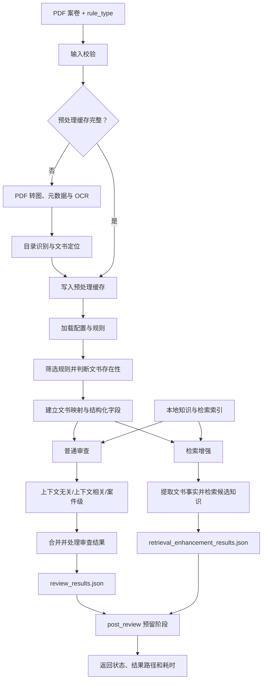

# 行政执法案卷智能审查

面向深圳市龙华区行政执法案卷的智能审查项目。系统接收 PDF 案卷和八位
`rule_type`，依次完成案卷预处理、规则筛选、多个审查执行器、检索增强以及结果
持久化。

当前仓库提供 Python 命令行入口和可复用的异步审查函数，不包含 HTTP 服务或
前端页面。后端可以在此基础上封装任务接口；前端只消费后端返回的状态和结果，
无需直接访问 `cache`、`database` 或 `knowledge`。

## 主要能力

- 将 PDF 转换为逐页图片，抽取案件元数据并执行全卷 OCR。
- 识别案卷目录，将目录项映射到实际文书 section。
- 根据 `rule_type`、文书存在性和 `data/all_rules.json` 构建本次规则集。
- 执行上下文无关、上下文相关和案件级三类审查。
- 在上下文无关审查中按规则注入可插拔外部知识。
- 为复杂规则单独生成检索增强结果，向人工提供文书事实和候选知识，不替代人工
  作出裁量结论。
- 缓存预处理、文书映射和结构化字段，避免重复 OCR 与抽取。
- 分离原始审查结果、处理后问题清单和检索增强结果。

## 总项目流程



关键边界：

- 外部知识只为当前普通审查规则提供上下文；知识函数返回空列表时不生成空的
  `external_knowledge` 区块。
- 检索增强与普通审查并列执行，结果单独保存，不进入问题清单的合并和后处理。
- `post_review` 当前是预留入口，不执行额外业务逻辑。

## 快速开始

### 1. 准备运行环境

项目当前使用 Conda 环境 `myenv`：

```powershell
conda activate myenv
```

在项目根目录创建本地 `.env`。模型调用通过 `langchain-openai` 的
`ChatOpenAI` 接口完成，至少需要配置：

```dotenv
REVIEW_VISION_MODEL=
REVIEW_VISION_BASE_URL=
REVIEW_VISION_API_KEY=
REVIEW_VISION_TEMPERATURE=0

REVIEW_TEXT_MODEL=
REVIEW_TEXT_BASE_URL=
REVIEW_TEXT_API_KEY=
REVIEW_TEXT_TEMPERATURE=0
```

`.env` 已被 Git 忽略，不应提交真实密钥。并发、限流、超时、日志和结果处理等
可选变量可在部署环境中按需配置。

### 2. 准备检索模型

联网环境无需手工操作，第一次执行向量检索时会自动获取
`BAAI/bge-small-zh-v1.5`。

离线部署时，先在可联网机器的项目根目录执行：

```powershell
conda run -n myenv python src/tools/download_retrieval_model.py
```

然后将生成的模型目录复制到离线部署包的相同位置。详细说明见
[`database/README.md`](database/README.md)。

### 3. 运行审查

```powershell
python .\src\main.py `
  --file_path "D:\path\to\case.pdf" `
  --rule_type 11110000
```

`file_path` 必须指向实际存在的 PDF。`rule_type` 支持八位二进制字符串、
`0b` 前缀二进制或等价十进制整数。

## rule_type 编码

| 位段 | 含义 |
| --- | --- |
| 前 3 位 | 是否启用合法性、规范性、附加审查；至少启用一项 |
| 中间 2 位 | `01` 行政检查、`10` 行政处罚、`11` 行政强制 |
| 后 3 位 | 文书子类型；处罚案卷使用 `0xx` 表示简易程序、`1xx` 表示普通程序 |

行政强制案卷的后 3 位分别表示行政强制措施、行政机关强制执行和申请人民法院
强制执行。

示例 `11110000` 表示：同时启用三类审查，文书类型为行政处罚，适用简易程序。

## 审查执行器

执行器由 [`src/config/review_pipeline.yaml`](src/config/review_pipeline.yaml)
统一启用：

| 执行器 | 输入范围 | 主要职责 | 输出去向 |
| --- | --- | --- | --- |
| `context_free` | 当前规则对应文书 OCR | 单文书审查，可按事务注入外部知识 | 普通审查结果 |
| `context_sensitive` | 当前 section 及跨文书结构化字段 | 一致性、时序和跨文书关联审查 | 普通审查结果 |
| `case_level` | 案卷目录及案件级事实 | 完整性等全案事项 | 普通审查结果 |
| `human_support` | 文书事实及知识检索结果 | 生成供人工复核的检索增强信息 | 独立检索增强结果 |

`human_support` 是检索增强执行器的内部包名，不表示系统会代替人工作出最终
判断。

## 规则、外部知识与检索增强

主规则位于 [`data/all_rules.json`](data/all_rules.json)。每条规则统一包含：

- `序号`
- `上下文无关审查事项`
- `上下文相关审查事项`
- `备注`
- `检索增强`

两种知识使用方式彼此独立：

| 机制 | 配置位置 | 用途 | 是否影响普通审查结论 |
| --- | --- | --- | --- |
| 外部知识 | 具体文书审查事务的 `外部知识` 列表 | 为当前规则补充可供模型参考的知识 | 是 |
| 检索增强 | 规则层的 `检索增强` 列表 | 向人工展示提取事实和候选知识 | 否 |

相关维护文档：

- [外部知识模块](src/external_knowledge/README.md)
- [检索增强执行层](src/human_support/README.md)
- [中立知识检索核心](src/knowledge_retrieval/README.md)
- [检索数据与离线模型](database/README.md)

## 缓存与结果

每个 PDF 使用“文件名 + 规范化路径哈希”生成独立文档键，避免同名文件互相覆盖。

```text
cache/<document-key>/
├─ pages/                         # PDF 页图
├─ image_list.json
├─ meta_info.json
├─ ocr_results.json
├─ dir_info.json
├─ structured_fields.json
├─ raw_review_results.json
└─ review_result_processing.json

results/<document-key>/
├─ review_results.json
├─ retrieval_enhancement_results.json
├─ review_error.json              # 审查阶段失败时生成
└─ flow_error.json                # 未捕获流程错误时生成
```

当 `image_list.json`、`ocr_results.json`、`dir_info.json` 和 `meta_info.json`
全部存在时，入口会复用预处理缓存。

## 项目目录

```text
documentReview/
├─ data/
│  └─ all_rules.json              # 主审查规则
├─ database/                      # 随项目发布的小型检索索引
├─ knowledge/                     # 运行必需的结构化知识及本地原始材料
├─ cache/                         # 按 PDF 隔离的运行缓存
├─ results/                       # 普通审查和检索增强结果
└─ src/
   ├─ main.py                     # 命令行总入口
   ├─ pre_review.py               # PDF、OCR、目录及 section 预处理
   ├─ review.py                   # 审查流水线编排
   ├─ post_review.py              # 后审查预留入口
   ├─ config/                     # 流水线、文书映射和字段配置
   ├─ reviewers/                  # 普通审查执行器及结果处理
   ├─ external_knowledge/         # 外部知识消费层
   ├─ human_support/              # 检索增强执行层
   ├─ knowledge_retrieval/        # 可复用的中立检索核心
   ├─ rules/                      # rule_type 解码、筛选和 RuleSet
   ├─ tools/                      # 索引维护、模型下载和检索观察工具
   └─ tests/                      # 单元与编排回归测试
```

`knowledge` 中除运行必需的结构化目录外，其余原始知识文件默认不进入 Git。
前端不需要读取该目录；后端部署时应保持项目内相对路径不变。

## 测试

在项目根目录执行：

```powershell
conda run -n myenv python -m unittest discover `
  -s src/tests `
  -p "test_*.py"
```

检索候选可以脱离完整审查流程单独观察：

```powershell
conda run -n myenv python src/tools/inspect_longhua_power_catalog_search.py

conda run -n myenv python `
  src/tools/inspect_city_management_discretion_retrieval.py `
  --law-name "《深圳经济特区市容和环境卫生管理条例》" `
  --article 65 `
  --case-reason "某垃圾转运站未安装视频监控设备案"
```
