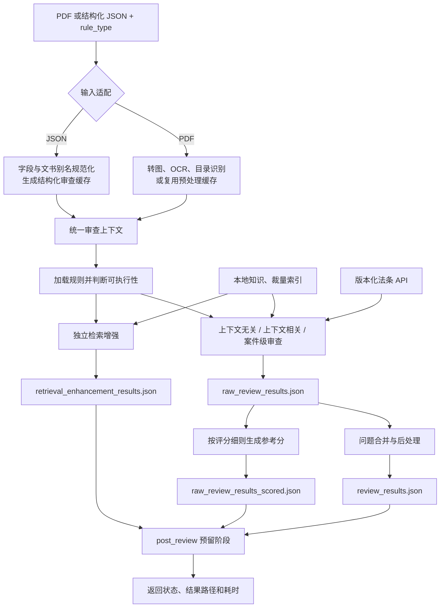

# 行政执法案卷智能审查

面向深圳市龙华区行政执法案卷的智能审查项目。系统接收 PDF 案卷或结构化
JSON 和八位 `rule_type`，依次完成输入适配、规则筛选、多范式审查、外部知识
检索、规则级评分以及结果持久化。

当前仓库提供 Python 命令行入口和可复用的异步审查函数，不包含 HTTP 服务或
前端页面。后端可以在此基础上封装任务接口；前端只消费后端返回的状态和结果，
无需直接访问 `cache`、`database` 或 `knowledge`。

## 主要能力

- 将 PDF 转换为逐页图片，抽取案件元数据并执行全卷 OCR。
- 识别案卷目录，将目录项映射到实际文书 section。
- 根据 `rule_type`、文书存在性和 `data/all_rules.json` 构建本次规则集。
- 执行上下文无关、上下文相关和案件级三类审查。
- 支持直接审查结构化 JSON：规范化文书名和字段名，生成独立缓存并复用现有
  审查执行器，无需先转换为 PDF 或重复 OCR。
- 按规则注入可插拔外部知识；其中版本化法条检索模块通过 HTTP API 使用案由、
  案情和案件日期召回候选法条，供模型核对法律适用。
- 为复杂规则单独生成检索增强结果，向人工提供文书事实和候选知识，不替代人工
  作出裁量结论。
- 根据每条规则的评分细则为原始审查结果生成参考分数；无问题规则直接取满分，
  有问题规则由模型按扣分规则评分，并执行完整性和分值范围校验。
- 缓存预处理、文书映射和结构化字段，避免重复 OCR 与抽取。
- 分离原始审查结果、带分结果、处理后问题清单和检索增强结果。

## 总项目流程




关键边界：

- 外部知识会注入当前规则的审查大模型上下文，并可影响该规则的审查结论；知识
  函数返回空列表时不生成空的 `external_knowledge` 区块。
- 法条 API 返回的带版本和生效期间的候选条文会作为外部知识交给审查大模型，由
  大模型结合文书内容判断法律适用。API 自身只负责检索，不独立生成审查结论；
  API 不可用时按外部知识失败降级，不阻断其他规则。
- 检索增强与普通审查并列执行，结果单独保存，不进入问题清单的合并和后处理。
- 规则级分数是独立参考结果，不覆盖原始审查结论；评分结果必须完整覆盖候选规则，
  且不能小于 0 或超过规则满分。
- 结构化 JSON 会生成与源文件路径绑定的独立缓存，源文件保持只读。
- `post_review` 当前是预留入口，不执行额外业务逻辑。

## 快速开始

### 1. 准备运行环境

项目当前使用 Conda 环境 `doc-review`：

```powershell
conda activate doc-review
```

在项目根目录创建本地 `.env`。模型调用通过 `langchain-openai` 的
`ChatOpenAI` 接口完成，至少需要配置：

```dotenv
REVIEW_VISION_MODEL=
REVIEW_VISION_BASE_URL=
REVIEW_VISION_API_KEY=
REVIEW_VISION_TEMPERATURE=0

REVIEW_TEXT_MODEL=
REVIEW_TEXT_BASE_URL=
REVIEW_TEXT_API_KEY=
REVIEW_TEXT_TEMPERATURE=0

# 仅启用 legal_citation_validity 外部知识的规则需要
LAW_RETRIEVAL_BASE_URL=https://review.zfqp.fun/law-api
LAW_RETRIEVAL_API_KEY=
LAW_RETRIEVAL_TIMEOUT_SECONDS=60
LAW_RETRIEVAL_MAX_RETRIES=2
```

`.env` 已被 Git 忽略，不应提交真实密钥。并发、限流、超时、日志和结果处理等
可选变量可在部署环境中按需配置。

### 2. 准备检索模型

联网环境无需手工操作，第一次执行向量检索时会自动获取
`BAAI/bge-small-zh-v1.5`。

离线部署时，先在可联网机器的项目根目录执行：

```powershell
conda run -n doc-review python src/tools/download_retrieval_model.py
```

然后将生成的模型目录复制到离线部署包的相同位置。详细说明见
[`database/README.md`](database/README.md)。

### 3. 运行审查

```powershell
python .\src\main.py `
  --file_path "D:\path\to\case.pdf" `
  --rule_type 11110000
```

结构化案件 JSON 使用相同入口：

```powershell
python .\src\main.py `
  --file_path "D:\path\to\case.json" `
  --rule_type 11110000
```

`file_path` 必须指向实际存在的 PDF 或 JSON。JSON 原文件保持只读，系统会在
独立缓存目录生成虚拟目录、结构化字段和伪 OCR 数据。`rule_type` 支持八位二进制字符串、
`0b` 前缀二进制或等价十进制整数。

结构化 JSON 的根节点以文书类型为键，每种文书可以是一个对象、对象数组或
`null`。字段名会按照 `src/config/rule_aliases.yaml` 和字段配置规范化，例如：

```json
{
  "行政处罚决定书": {
    "行政处罚决定书文号": "〔2021〕示例综行罚字第001号",
    "案由": "未按规定履行义务案",
    "违法事实": "当事人于……实施了……行为。",
    "处罚依据": "依据《示例条例》第十条……",
    "行政处罚内容": "处人民币二千元罚款。"
  },
  "立案审批表": [
    {
      "立案日期": "2021-01-01",
      "案件来源": "监督检查"
    }
  ]
}
```

系统会保留未识别的原始字段，同时对已配置字段做空值归一化和基础类型转换，
然后建立文书 section、元数据和结构化字段缓存，继续走与 PDF 相同的规则筛选和
审查流程。

## rule_type 编码

| 位段      | 含义                                                            |
| --------- | --------------------------------------------------------------- |
| 前 3 位   | 是否启用合法性、规范性、附加审查；至少启用一项                  |
| 中间 2 位 | `01` 行政检查、`10` 行政处罚、`11` 行政强制                     |
| 后 3 位   | 文书子类型；处罚案卷使用 `0xx` 表示简易程序、`1xx` 表示普通程序 |

行政强制案卷的后 3 位分别表示行政强制措施、行政机关强制执行和申请人民法院
强制执行。

示例 `11110000` 表示：同时启用三类审查，文书类型为行政处罚，适用简易程序。

## 审查执行器

执行器由 [`src/config/review_pipeline.yaml`](src/config/review_pipeline.yaml)
统一启用：

| 执行器              | 输入范围                        | 主要职责                         | 输出去向         |
| ------------------- | ------------------------------- | -------------------------------- | ---------------- |
| `context_free`      | 当前规则对应文书 OCR            | 单文书审查，可按事务注入外部知识 | 普通审查结果     |
| `context_sensitive` | 当前 section 及跨文书结构化字段 | 一致性、时序和跨文书关联审查     | 普通审查结果     |
| `case_level`        | 案卷目录及案件级事实            | 完整性等全案事项                 | 普通审查结果     |
| `human_support`     | 文书事实及知识检索结果          | 生成供人工复核的检索增强信息     | 独立检索增强结果 |

`human_support` 是检索增强执行器的内部包名，不表示系统会代替人工作出最终
判断。

## 结构化审查

[`src/structured_input.py`](src/structured_input.py) 是 JSON 输入适配层，主要完成：

- 文书类型和字段别名归一化；
- `null`、空字符串、“空”等空值标记统一；
- 按字段配置转换布尔值、数值、日期和列表等基础类型；
- 从案号、案由、案情、处罚依据等字段构建案件元数据；
- 生成虚拟文书目录、section 映射、伪 OCR 和 `structured_fields.json`；
- 预热上下文相关规则所需字段，使 PDF 与 JSON 共用同一套审查执行器。

这种做法避免为已有业务数据重复生成 PDF 和 OCR，同时保持规则、外部知识、结果
处理及评分流程一致。

## 规则级评分

每条规则可在 `data/all_rules.json` 的 `评分细则` 中声明 `分值`、`评查方式` 和
`评查说明`。审查完成后，[`src/reviewers/rule_scoring.py`](src/reviewers/rule_scoring.py)
读取原始逐规则结果并生成 `raw_review_results_scored.json`：

- 没有问题且属于评分项的规则直接获得满分；
- 有问题的规则将问题、满分和评分说明交给评分模型计算剩余分数；
- 程序校验评分是否完整覆盖候选规则，以及是否位于 `0` 到满分之间；
- 模型不可用时按评分说明中可识别的扣分数字执行保守兜底估算；
- 非评分项、规则执行异常或缺少有效分值时，分数为 `null` 并记录原因。

评分结果用于复核和统计参考，不修改 `raw_review_results.json`，也不替代最终人工
认定。

## 规则、外部知识与检索增强

主规则位于 [`data/all_rules.json`](data/all_rules.json)。每条规则统一包含：

- `序号`
- `上下文无关审查事项`
- `上下文相关审查事项`
- `备注`
- `检索增强`

两种知识使用方式彼此独立：

| 机制     | 配置位置                           | 用途                             | 是否影响普通审查结论 |
| -------- | ---------------------------------- | -------------------------------- | -------------------- |
| 外部知识 | 具体文书审查事务的 `外部知识` 列表 | 为当前规则补充可供模型参考的知识 | 是                   |
| 检索增强 | 规则层的 `检索增强` 列表           | 向人工展示提取事实和候选知识     | 否                   |

### 版本化法条 API 外部知识

规则在 `外部知识` 中配置 `legal_citation_validity` 后，系统会：

1. 从审查上下文读取案由、案情以及规则声明的附加字段；
2. 优先从规则声明的日期字段生成 `as_of`，用于检索案件发生时有效的法规版本；
3. 调用 `${LAW_RETRIEVAL_BASE_URL}/retrieve`，请求法条正文和相关片段；
4. 将法规名称、条号、版本、生效期间和正文作为候选知识注入当前审查任务；
5. 对相同请求做进程内缓存，并对 HTTP 502/503 按配置重试。

候选法条会被序列化到当前规则提示词的 `external_knowledge` 区块，由审查大模型
结合文书事实、规则要求和候选条文形成该规则的结论。检索 API 本身不负责选择
最终违法依据或处罚依据。缺少 API Key、网络异常或返回格式异常时，知识服务
记录警告并返回空知识，其他审查规则仍可继续。

### 裁量标准检索增强

`city_management_discretion_candidates` 当前用于案号匹配“综行…罚”的街道综合
执法案件。模块先按处罚依据中的法规名称和条号精确召回《深圳市城市管理行政
处罚裁量权实施标准（2023年版）》候选，再用案由与候选“违法行为”的向量相似度
排序，最多返回 5 个候选及完整裁量分组供人工核对。向量模型不负责直接判定最终
裁量档次。

相关维护文档：

- [外部知识模块](src/external_knowledge/README.md)
- [检索增强执行层](src/human_support/README.md)
- [中立知识检索核心](src/knowledge_retrieval/README.md)
- [检索数据与离线模型](database/README.md)

## 缓存与结果

每个 PDF 使用“文件名 + 规范化路径哈希”生成独立文档键，避免同名文件互相覆盖。

```text
cache/<document-key>/
├─ pages/                         # PDF 页图
├─ image_list.json
├─ meta_info.json
├─ ocr_results.json
├─ dir_info.json
├─ structured_fields.json
├─ raw_review_results.json
├─ raw_review_results_scored.json # 在原始逐规则结果上增加分数和扣分/加分说明
└─ review_result_processing.json

results/<document-key>/
├─ review_results.json
├─ retrieval_enhancement_results.json
├─ review_error.json              # 审查阶段失败时生成
└─ flow_error.json                # 未捕获流程错误时生成
```

当 `image_list.json`、`ocr_results.json`、`dir_info.json` 和 `meta_info.json`
全部存在时，入口会复用预处理缓存。

## 项目目录

```text
documentReview/
├─ data/
│  └─ all_rules.json              # 主审查规则
├─ database/                      # 随项目发布的小型检索索引
├─ knowledge/                     # 运行必需的结构化知识及本地原始材料
├─ cache/                         # 按 PDF 隔离的运行缓存
├─ results/                       # 普通审查和检索增强结果
└─ src/
   ├─ main.py                     # 命令行总入口
   ├─ pre_review.py               # PDF、OCR、目录及 section 预处理
   ├─ structured_input.py         # 结构化 JSON 输入适配与缓存生成
   ├─ review.py                   # 审查流水线编排
   ├─ post_review.py              # 后审查预留入口
   ├─ config/                     # 流水线、文书映射和字段配置
   ├─ reviewers/                  # 审查执行器、结果处理与规则级评分
   ├─ external_knowledge/         # 外部知识消费层
   ├─ human_support/              # 检索增强执行层
   ├─ knowledge_retrieval/        # 可复用的中立检索核心
   ├─ rules/                      # rule_type 解码、筛选和 RuleSet
   ├─ tools/                      # 索引维护、模型下载和检索观察工具
   └─ tests/                      # 单元与编排回归测试
```

`knowledge` 中除运行必需的结构化目录外，其余原始知识文件默认不进入 Git。
前端不需要读取该目录；后端部署时应保持项目内相对路径不变。

## 测试

在项目根目录执行：

```powershell
conda run -n doc-review python -m unittest discover `
  -s src/tests `
  -p "test_*.py"
```

检索候选可以脱离完整审查流程单独观察：

```powershell
conda run -n doc-review python src/tools/inspect_longhua_power_catalog_search.py

conda run -n doc-review python `
  src/tools/inspect_city_management_discretion_retrieval.py `
  --law-name "《深圳经济特区市容和环境卫生管理条例》" `
  --article 65 `
  --case-reason "某垃圾转运站未安装视频监控设备案"
```
