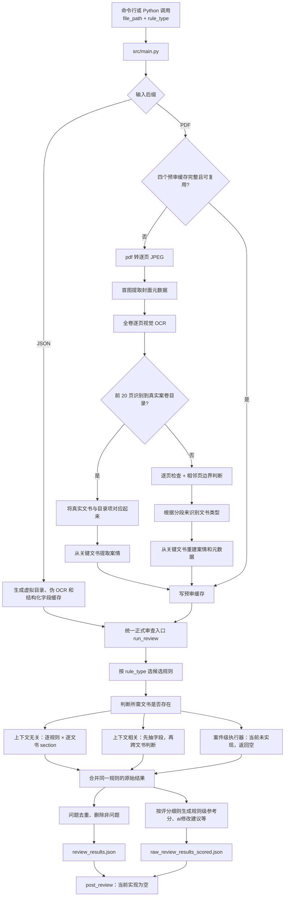

# 行政执法案卷智能审查项目

> 面向行政执法案卷的智能审查系统。项目支持 PDF 与结构化 JSON 输入，通过文书分段、规则筛选、结构化字段抽取、外部知识检索和多范式审查，生成可追溯的问题清单、人工复核资料与规则级参考评分。本文档以当前工作区代码为准，默认规则文件为 `data/all_rules_2026_with_fields.json`。

## 1. 项目概述

这个项目接收一份行政执法案卷（PDF 或结构化 JSON）和一个八位 `rule_type`，先把原始材料整理成统一的“案件元数据 + 文书目录 + section OCR + 结构化字段缓存”，再按规则分别做单文书审查、跨文书审查和人工检索辅助，最后输出原始问题、合并后的问题、规则级参考评分和人工复核资料。

它不是一个“把整本 PDF 一次扔给大模型，让模型自由判断”的程序。真正的设计思路是：

1. 先把案卷拆成可定位的文书 section；
2. 再根据规则只选择需要的文书和字段；
3. 每条规则只获得被允许的数据；
4. 需要法条或目录知识时，由规则显式声明知识函数；
5. 模型输出之后再做结构校验、定位修复、合并和评分。

## 2. 总流程图



## 3. 程序入口与运行参数

真实入口是 `src/main.py` 的 `main()`。

### 3.1 参数

命令行需要三个参数：

- `--file_path`：必填，只允许 `.pdf` 或 `.json`；
- `--rule_type`：必填，可写八位二进制字符串、`0b` 前缀二进制或十进制整数；
- `--rules_path`：可选，默认指向 `data/all_rules_2026_with_fields.json`。

示例：

```powershell
python .\src\main.py --file_path "D:\cases\case.pdf" --rule_type 11110000
```

`.env` 在导入其他项目模块之前加载，而且使用 `override=True`，即 `.env` 中同名值会覆盖进程原有环境变量。随后程序校验：规则类型是否合法、规则文件是否存在、输入文件是否存在且后缀正确。

运行前至少需要配置文本模型和视觉模型。可在项目根目录创建不含真实示例密钥的 `.env`：

```dotenv
REVIEW_VISION_MODEL=
REVIEW_VISION_BASE_URL=
REVIEW_VISION_API_KEY=
REVIEW_VISION_TEMPERATURE=0

REVIEW_TEXT_MODEL=
REVIEW_TEXT_BASE_URL=
REVIEW_TEXT_API_KEY=
REVIEW_TEXT_TEMPERATURE=0

# 仅使用版本化法条检索的规则需要（该法条api由于维护时常无法使用，且需要使用连接vpn访问内网，可暂时空着）
LAW_RETRIEVAL_BASE_URL=
LAW_RETRIEVAL_API_KEY=
```

真实凭证只能放在本地 `.env` 或部署环境中，不应写入 README 或提交到 Git。

### 3.2 `rule_type` 八位含义

`rules/rule_type.py` 使用位掩码解析：

| 位段      | 含义                                                     |
| --------- | -------------------------------------------------------- |
| 前 3 位   | 合法性、规范性、附加审查是否启用，至少一位为 1           |
| 中间 2 位 | `01` 行政检查，`10` 行政处罚，`11` 行政强制；不能为 `00` |
| 后 3 位   | 子类型                                                   |

行政处罚只读取后三位中的最高位：`0xx` 为简易程序，`1xx` 为普通程序；其余两位当前不影响处罚规则选择。行政强制则把后三位分别解释为“行政强制措施、行政机关强制执行、申请人民法院强制执行”，可以多选。

当前默认规则文件共 242 条：合法性 71 条、规范性 171 条，附加项和加减分项当前均为 0 条。一次运行不会执行全部 242 条，而是先按 `rule_type` 选择业务范围，再按文书是否存在和是否能映射到 section 继续过滤。

### 3.3 三段式主调用

`main()` 的顺序固定为：

1. PDF 调用 `run_pre_review()`，JSON 调用 `prepare_structured_json()`；
2. 调用 `run_review()` 正式审查；
3. 调用 `run_post_review()`。

第三步目前只是预留接口，返回 `completed=True` 和 `post_review is currently a no-op`，没有额外业务处理，因此不属于已经实现的复审阶段。

## 4. 缓存和文件身份：同名文件为什么不会互相覆盖

`src/cache_paths.py` 用“安全化文件名 + 规范化绝对路径的 SHA-256 前 12 位”生成 `document_key`。因此两个目录下同名 PDF 通常会得到不同缓存目录。

主要缓存位于：

```text
cache/<document-key>/
├─ pages/                         # PDF 逐页 JPEG
├─ image_list.json                # 图片路径列表
├─ ocr_results.json               # 每页 OCR
├─ meta_info.json                 # 案件元数据和案情
├─ dir_info.json                  # section 目录与页界
├─ structured_fields.json         # 文书存在性、映射、字段、送达事件
├─ raw_review_results.json        # 原始逐规则问题
├─ review_result_processing.json  # 问题合并过程结果
└─ raw_review_results_scored.json # 带分原始结果及总分
```

最终展示结果位于：

```text
results/<document-key>/
├─ review_results.json
├─ retrieval_enhancement_results.json
└─ review_error.json 或 flow_error.json（发生相应错误时）
```

PDF 只有在 `image_list.json`、`ocr_results.json`、`dir_info.json`、`meta_info.json` 四个文件全部存在时才可能跳过预审。若 `dir_info.json` 中含无目录分段项，还会检查 `segmentation_schema_version` 是否等于当前版本 2。注意：这里主要检查“文件存在和无目录版本”，不会重新计算 PDF 内容哈希；原路径上的 PDF 被替换而缓存文件仍在时，有复用旧缓存的风险。

`structured_fields.json` 的失效条件更严格：它的指纹包含元数据、目录、OCR 和文书映射配置，且要求 schema version 为 6。任何一项变化，加载时都会得到一份新的空缓存。

## 5. PDF 预审公共流程

PDF 预审由 `src/pre_review.py` 的 LangGraph 状态图执行。

### 5.1 PDF 转图

PyMuPDF 以 200 DPI、RGB 渲染每一页，输出 `page_000.jpeg` 一类文件。页序是零基索引；如果 PDF 没有页面，预审直接失败。图片路径写入 `image_list.json`。

### 5.2 封面元数据

视觉模型只看第一页，使用 `case_metadata_extractor` 提示词提取：执法单位、案卷名称、案号、案由、当事人、立案日期、结案日期、处理结果、承办人员及证号，以及未预设的额外字段。

这一步强调只依据封面可见内容，不允许用其他文书补写。结果先写入 `meta_info.json`。但对“最终认定为无目录”的 PDF，这份首图结果后来会被主动清空并由关键文书重建，原因见无目录流程。

### 5.3 全卷 OCR

每页独立调用视觉 OCR。默认每批并发 4 页，实际值取 `REVIEW_MODEL_MAX_CONCURRENCY`。OCR 提示词要求：

- 普通印刷文字按自然阅读顺序输出；
- 页码、手写、签名、印章、指印、涂改、图片、证照等用规定的 `<div>` 标签表达；
- 不总结、不纠错、不补写；
- 二维码跳过，空页可返回空。

代码会去除模型的 `<think>` 内容。单页失败不会让整本 PDF 立即失败，而是保留空 `document_content` 和错误文本，后续仍可继续。

有一个专门的 OCR 兜底：若某页识别出至少 3 个印章元素，但排除印章和页码后的有效正文不足 80 个字符，代码认为模型可能只看到了章和日期，会用更强的“必须识别标题、文号和正文”提示再读一次。两次结果比较有效正文字符数，只在重试结果更丰富时替换首次结果。

OCR 落盘后，目录识别分流才开始。

## 6. 有目录 PDF：目录怎样变成真实 section

### 6.1 什么才算目录

系统从 PDF 第 1 页开始逐页调用 `directory_classifier`。提示词明确区分：

- 真正独立成页、覆盖整卷的案卷目录；
- 移交函、移送函正文后的附件清单或随附资料目录。

第二类不能当成全卷目录。模型优先看 OCR，只有 OCR 缺失、明显错乱或无法判断时，才允许查看当前页图片。

若连续多页都是目录，目录项持续累加；已经发现目录后遇到第一张非目录页，就把该页记为正文起点并结束目录扫描。若最初 20 页始终没有发现目录，就转入无目录流程；如果 PDF 少于 20 页，则扫描到末页仍无目录时转入无目录流程。

### 6.2 目录中的页码不能直接当 PDF 页码

目录项的 `catalog_page` 是目录印刷页号，PDF 前面可能有封面、目录等额外页面。代码从 OCR 的 `<div type="page-number">` 中估算“PDF 零基页索引 - 印刷页号”的多数偏移量，再据此预测目录项起始页。

对每个目录项，候选页顺序是预测页以及附近的 `0、-1、+1、-2、+2` 偏移，且受前后已定位区间约束。交给 `section_classifier` 的单页 OCR 最多 4,000 字符：长文本保留约四分之三页首和四分之一页尾，中间注明已省略。

### 6.3 模型判断和降级定位

模型对“当前目录项是否属于当前页”返回：

- `match`：接受该页；
- `conflict`：继续试下一候选页；
- `unknown`：如果它恰好是有可靠页号推算的预测页，也接受预测页。

定位结果附带来源和置信度：

- 页号预测与语义匹配同时成立：`page_and_semantic`，0.95；
- 附近页语义匹配：`nearby_semantic`，0.85；
- 语义无法判断但采用目录页号：`catalog_page`，0.65；
- 全部候选未匹配，仍保留预测页：`location_fallback`，0.3，并设 `needs_review=true`。

所以“目录定位成功”不总等于模型确认，低置信度项需要人工关注。

### 6.4 section 的结束页从哪里来

正式审查读取某个 section 时，`section_page_range()` 使用当前 section 的 `section_page` 作为起点、下一目录项的 `section_page` 作为终点；最后一个 section 延伸到 OCR 总页数。结束位置是左闭右开区间。因此目录项顺序和起始页正确性非常重要。

### 6.5 案情提取

所有目录项定位后，代码只在以下文书中选择第一份可用文书：

1. 行政处罚决定书；
2. 结案审批表；
3. 立案审批表。

它把该 section 的全部 OCR 交给 `case_facts_extractor`，而不是把全卷证据交给模型。目标仅是概括当事人、明确的时间地点和核心行为事实，禁止输出法律分析、法条编号、处罚依据或处罚结论。若返回空案情，可以按 `CASE_FACTS_EXTRACTION_MAX_ATTEMPTS` 重试；始终无结果则写 `案情=null` 并继续。

## 7. 无目录 PDF：怎样切分、命名并重建元数据

无目录不是“跳过目录直接审查全文”，而是先人为构造一份覆盖整卷的 section 目录。

### 7.1 先生成确定性的逐页 profile

每页先在本地处理，不调用模型。profile 包含：

- 页首最多 1,000 字符、页尾最多 700 字符；
- 去掉标签后的正文长度；
- 文号模式；
- OCR 标记的印刷页码；
- “第 X 页/共 X 页”；
- 日期；
- “续页、接上页、续表、附件”等延续信号；
- “决定书、通知书、审批表、笔录、身份证、营业执照”等起始信号；
- “以下无正文、签名、盖章、日期”等结束信号；
- OCR 图片标签类型；
- 前八个非空行和可能的标题行。

### 7.2 每两个相邻页面必须作出边界判断

`page_boundary_classifier` 看到当前分段起始页、上一页、当前页和下一页的 profile，只能返回 `same_document` 或 `new_document`。其原则是“没有明确换件信号时默认合并”，以减少 OCR 缺字导致的过度切分。

模型结果之后还有确定性护栏，护栏可以覆盖模型：

- 当前页与上一页头部相似度至少 0.9：强制同一文书；
- 当前页开头出现强续页标志：强制同一文书；
- 文书内部页码连续，或从第 1 页起的总页数序列一致：强制同一文书；
- 模型认为是新文书时，只有出现新文号、从文书第 1 页开始、明显标题、图片类型改变，或上一页有结束标记且相似度低于 0.35，才接受切分；否则仍强制合并。

每个边界的模型理由和护栏理由保存在状态中的 `segment_boundary_reasons`，但最终主要落盘的是分段目录。

### 7.3 给每段命名

边界确定后，模型只看每段起始页 profile，通过 `segment_start_classifier` 判断：

- `case_document`：正式办案文书；
- `evidence_material`：证据材料；
- `other_material`：其他材料。

同时输出规范文书类型、材料类型和主体角色。证据材料可能形成“当事人 + 身份证材料”一类通用名称。代码会删除六位以上数字、疑似文号和已知敏感元数据，禁止把姓名、证件号、具体单位或流水号当作类型名称。

最终每页必须且只能属于一个 section，section ID 从 1 连续编号，不允许遗漏、重叠或空分段。无目录项记录：

- `catalog_source=ocr_segmented`；
- `segmentation_schema_version=2`；
- `location_source=ocr_segmentation`；
- `section_kind`、`material_type`、`subject_role`、`normalized_document_type`；
- 明确的 `section_page` 和 `section_end_page`。

### 7.4 为什么无目录会丢弃第一次封面元数据

代码在一开始并不知道 PDF 没目录，仍然读取过第一页作为“封面”。确定无目录后，`_build_page_profiles()` 会把 `case_metadata` 清空。原因是无目录文件第一页未必是封面，用它生成的案号、案由等不够可靠。

之后按以下优先顺序重新提取：行政处罚决定书 → 结案审批表 → 立案审批表。每次只要求当前仍缺失的字段：案情、执法单位、案卷名称、案号、案由、当事人、立案日期、结案日期、处理结果、承办人员及证号。前一份文书已经提取出的非空值不会被后一份覆盖，直到字段补齐或三类文书用完。最后所有字段都会存在，未取得者为 `null`。

## 8. 结构化 JSON：不做 OCR，但仍复用同一审查体系

JSON 路径由 `src/structured_input.py` 完成，而且每次运行都会重新准备，不走 PDF 的四文件复用判断。

### 8.1 接受的数据形状

根节点必须是对象。每个顶层键代表一种文书，其值可以是：

- 一个对象：一份文书；
- 对象数组：同类型多份文书；
- `null`：没有记录；
- 其他类型：报错。

以 `__` 开头的顶层键被当作辅助元数据跳过。每一条文书记录都会变成一个独立 section，按出现顺序分配连续 ID。

### 8.2 规范化

文书名通过 `rule_aliases.yaml` 转成规范文书类型；字段名也做别名归一。对于配置字段，还支持：

- 字符串、datetime；
- bool，并接受“是/有/true/1/yes”和“否/无/false/0/no”；
- int、float；
- dict、`list[dict]`、`list[str]`；
- `literal[...]` 枚举。

空字符串、`空`、`null`、`none`（不区分英文大小写）统一变成 `null`。无法成功转换的值目前不会强制报错，而会保留原值；未识别或未配置的字段也会保留。

### 8.3 构造和 PDF 相同的中间形态

代码生成：

- 虚拟 `dir_info`：每条记录占一个 section；
- 伪 OCR：用 `[structured_document]...[/structured_document]` 包裹原记录 JSON；
- 空 `image_list`；
- 从所有记录的首个可用值构建元数据；
- 按规则需求和预热配置构建文书存在性、映射和字段缓存。

元数据的来源是确定性的字段候选，例如案号依次尝试“行政处罚决定书文号、案件编号、案件案号、案号”；案情尝试“违法事实、违法事实/行为、案件简介”；处理结果尝试“行政处罚内容、处罚决定种类、处罚类别”。源文件字节还会计算 SHA-256 写入元数据。

### 8.4 送达回证在结构化 JSON 中的特殊处理

每一条送达回证记录直接生成一个送达事件。若记录含“文书名称”，先尝试精确匹配源顶层文书名，唯一命中时建立关联；否则规范化文书名，只有对应类型恰好有一个 section 时才关联。不能唯一确定则保留未关联，不猜测。

结构化输入已经有字段，因此上下文相关准备通常直接复用缓存，不重新让模型从伪 OCR 中抽取已有字段。不过后续规则若请求源 JSON 没有、缓存也没有的字段，仍可能触发字段提取流程。

## 9. 正式审查前：规则筛选、文书存在性和 section 映射

PDF 与 JSON 到这里已经统一进入 `run_review()`。

### 9.1 先按业务类型选规则

`RuleSetBuilder` 根据 `rule_type`：

- 合法性：加入“通用”规则，再加入对应文书类型规则；
- 规范性：加入对应文书类型规则；
- 行政处罚：只保留备注为空或与简易/普通程序一致的规则；
- 行政强制：只保留备注为空或属于启用强制子类型的规则；
- 最后统一做规则和文书/字段别名规范化。

### 9.2 判断需要哪些文书

上下文无关执行器从规则的“上下文无关审查事项”取文书名；上下文相关执行器从各事项“字段”配置取文书名，并额外加入预热文书；人工辅助从配置了“检索增强”的规则取文书名。

程序先尝试确定性映射配置。无法确定的文书才交给模型做存在性判断。如果模型存在性判断整体失败，未解决的文书都按“不存在”处理，以避免对不存在材料继续审查。

### 9.3 文书类型映射到 section

文书“存在”还不够，必须知道它对应哪些 `section_id`。`DocumentReviewPreparationService` 的顺序是：

1. 优先读取结构化字段缓存中的既有映射；
2. 用 `document_mapping.yaml` 的确定性标题、材料类型、主体角色等匹配；
3. 把剩余文书类型、精简目录、相容类型组和已确定映射交给模型；
4. 最多尝试 3 次，错误信息会附加到下一次提示词；
5. 宽松校验：保留合法映射，丢弃无效映射并记录日志。

映射的重要约束：

- section ID 必须真实存在；
- 非回证文书不能映射到标题明显是送达回证/回执的 section；
- 通常一个 section 只属于一个文书类型；只有配置中的相容类型组可以共享；
- 给模型前会移除目录标题的方括号后缀，避免把注释误当正文类型；
- 确定性映射优先于模型映射。

完成映射后，规则再次过滤。无法映射到实际 section 的文书事项不会执行。

## 10. 上下文无关审查：一份文书自己就能判断的问题

入口是 `ContextFreeReviewExecutor`。它的执行粒度是“规则 × 规则指定文书类型 × 该类型每个 section”。不同 section 受全局信号量控制并发执行。

### 10.1 模型实际得到什么

每个任务输入包括：

- 当前规则中该文书的“审查事项”和“评查说明”；
- 规则备注，作为“适用范围”；
- 案件元数据；
- 当前规范文书名和 section ID；
- 当前 section 从起始页到下一 section 前一页的完整 OCR；
- 当前规则显式声明的外部知识；
- 若是有关联对象的送达回证，附加本次只审查哪个送达事件的 scope。

它不应读取其他 section。PDF 输入时允许一次性调用“查看当前 section 图片”工具，用于核对签名、印章、勾选、版式或疑似 OCR 错误；结构化 JSON 输入禁用图片工具。

### 10.2 提示词边界

核心限制是“当前规则是唯一标准”：应当载明类规则默认只查有没有填写，不能自动扩张成跨文书一致性；元数据只能帮助理解，规则没要求就不能拿它判错；手写 OCR 只适合判断有无填写，不能据此判断错字；需要外部法律标准却没有取得可靠知识时不得凭模型记忆下结论。

模型输出协议只有：

```json
{
  "issues": [
    {"section_ids": [3], "content": "问题说明"}
  ]
}
```

模型偶尔附带 `reason`、`detail` 等额外键时，程序在 Pydantic 校验前删除这些键，但其他结构错误仍会报错。

### 10.3 送达回证范围

如果规则没有配置“送达回证关联文书”，则审查所有回证 section。若配置了关联文书，系统先依赖结构化字段缓存中的送达事件映射，只选择与目标文书 section 关联的回证，并在提示词中加入目标文书名、目标 section、已抽取的文号及本次允许审查的事件。这样一张包含多个送达记录的回证不会把别的文书事件混进当前规则。

### 10.4 单项失败怎样处理

单 section 有 1,500 秒默认任务超时。超时或其他异常不会丢掉整卷，会为该规则生成带错误编号的“待人工复核”问题。一个规则涉及多个 section 时，先合并 section 结果；同一规则在不同执行范式产生的结果最终再按 `rule_index` 合并。

## 11. 上下文相关审查：先抽字段，再跨文书判断

入口是 `ContextSensitiveReviewExecutor`。它分为“准备结构化字段”和“执行规则”两段。

### 11.1 为什么先预热字段

同一个字段可能被多条规则重复使用。代码先汇总：

- `context_sensitive.yaml` 中固定预热字段；
- 本次适用规则中所有上下文事项所需字段。

当前固定预热包括立案审批表、现场检查（勘验）笔录、行政处罚决定书、结案审批表的“执法主体名称”，以及送达回证当前配置的全部字段。

字段缓存按 section 存储。并发请求同一字段时，`StructuredFieldCache` 会共享正在执行的任务，避免重复模型调用；抽取成功后原子写回 JSON。

### 11.2 普通文书字段如何提取

对每个 section，模型只收到：规范文书类型、字段名、字段类型、可选 notes 和该 section OCR。字段配置来自人工 `section_fields.yaml` 与生成配置 `generated_context_section_fields.yaml` 的合并；若规则临时请求了未配置字段，PDF 路径会默认按字符串字段处理并标明“数据库字段未单独配置类型”。

模型必须原样返回全部请求键，不能多、不能少，值必须符合类型或为 `null`。第一次抽取后，所有仍为 `null` 的字段会再严格重读一次；提示明确禁止用近义字段、地址、近似时间或推测填空。第二次仍无明确值就保留 `null`。

### 11.3 送达回证为什么不按普通文书处理

一张回证可能包含多条送达事件。系统先用 `delivery_receipt_extraction` 判断实际事件数，为每个事件保存：顺序号、事件原文和字段。然后给事件分配全局 event ID，并尝试映射到被送达文书 section。

映射优先走确定性逻辑：

1. 若事件含文书名称，规范化后与目录 section 名匹配；
2. 多个候选时优先最近的前置文书；
3. 没有名称命中时，尝试最近的前置非回证文书；
4. 确定性不能解决才调用 `delivery_receipt_mapping` 模型；
5. 模型失败用技术失败标志 `-1`，普通“无法关联”则是 `null`；
6. 同一回证中两个事件不能重复绑定同一个目标 section，后者会降为未关联。

技术失败会阻止依赖该映射的正式上下文审查，避免把系统故障误当成案卷缺陷。

### 11.4 一致性核查

任务名为“一致性核查”时，每个字段来源带有：文书类型、section ID、字段名、是否必填、字段类别和值；回证还带关联 section ID。字段类别只有“审查对象”和“辅助支撑”。

执行顺序：

1. 已存在且映射成功的文书中，`required=true` 且值为 `null`，程序直接生成“未提取到必填字段”问题；
2. `null` 不参加值比较；
3. 至少两个非空来源才调用模型判断语义是否一致；
4. 不一致时输出理由和所有来源值；
5. 涉及送达回证时，以目标文书 section 为锚点分组，避免不同送达对象互相比较。

只有 section 恰好一页时，字段来源会带可靠 PDF 页码；多页 section 不猜具体页。

### 11.5 主体合法、事实、法律适用、程序合法等分类任务

除了“一致性核查”，当前规则中还出现“主体合法”“事实清楚、证据充分”“适用法律准确”“程序合法”和“不予处罚合法性审查”等任务。代码对任何非空字符串任务都允许进入分类审查；其中“不予处罚合法性审查”使用专门提示词，其他非一致性任务统一使用 `categorized_contextual_review`。

模型只收到精简后的任务、评查类别、审查事项、评查说明，以及分组后的非空字段来源和外部知识。普通分类任务仍会先输出必填字段问题；“不予处罚合法性审查”不自动追加该类必填字段问题，由专门模型整体判断。

## 12. 外部知识：什么时候用、拿什么去查、失败后怎么办

外部知识采用规则显式声明机制：不是所有规则默认联网，也不允许模型自行搜索。只有规则的具体审查事项在“外部知识”数组中显式写了注册函数名，程序才调用。

当前默认规则文件实际使用三个知识函数：

### 12.1 `legal_citation_validity`：版本化法条检索

用途：给“适用法律准确”等规则提供候选法条，供审查模型核对。它自己不直接断言案卷违法依据正确或错误。

查询材料的形成过程：

1. 上下文无关规则可在“法条检索查询.字段”中指定当前文书或其他文书字段，程序先用字段提取模型取值；上下文相关规则直接使用已经抽出的来源字段；
2. 优先把“违法依据、处罚依据、责令改正法律依据、不予处罚依据”放入查询，其次是裁量依据、裁量档次、违法事实；
3. 查询必须有案由，缺失时依次尝试违法事实、案件简要情况、处理结果；
4. 查询还必须有案情；缺失时用违法事实、案件简要情况、处罚具体内容、陈述申辩处理结果、处理结果、立案/结案日期拼接，仍没有时退回案由；
5. 配置字段部分最多 140 字，整个查询最多 200 字；法律依据类单值最多 60 字，其他支持字段单值最多 36 字；
6. 日期 `as_of` 优先使用规则配置日期字段，再尝试案发日期、违法行为发生日期、立案日期、结案日期，且必须能解析为 ISO 日期。

请求发送到 `LAW_RETRIEVAL_BASE_URL/retrieve`，默认 `top_k=3`、`version_k=7`，要求返回正文和聚焦片段。需要 `LAW_RETRIEVAL_API_KEY`。HTTP 502/503 可按配置重试，其他网络或解析失败由知识服务捕获并降级。相同请求在进程内有内存缓存。

返回给审查模型的每个候选包括法规名、条号、版本 ID、生效区间、相关片段和完整正文，并明确注明“仅供核对，不作为自动选取违法或处罚依据”。

### 12.2 `longhua_subdistrict_penalty_items_catalog`：龙华街道承接处罚事项目录(目前没有规则配置这个外部知识，可不了解)

它先依据案号/案件编号判断案件类型，只有街道综合执法处罚案件继续；应急、消防、市监和无法识别类型直接返回空。案由依次取案由、事由、案件名称；上下文无关且当前是行政处罚决定书时，必要时可再从该 section OCR 概括案由。

随后用本地持久化向量索引和 sentence-transformers 模型检索，默认 top 3、最低相似度 0.50。返回事项名称、相关区主管部门、实施范围、备注及制度解释。知识文本特别说明：目录实施范围中的街道办事处是法定执法主体，街道所属综合行政执法队本身不是独立主体，应以街道办事处名义执法。

如果本地索引、embedding 文件或模型不可用，返回空，不让整卷失败。

## 13. “检索增强”不是“外部知识”：人工辅助链路（之前的需求，目前不使用其结果，但保留）

规则顶层的“检索增强”由 `HumanSupportExecutor` 执行，和自动审查并列，但其结果不进入问题合并、不会改变自动审查结论。

当前唯一模块是 `city_management_discretion_candidates`，用于《深圳市城市管理行政处罚裁量权实施标准（2023年版）》候选检索。流程是：

1. 只对可识别为街道综合执法处罚案的文书运行；
2. 从每个目标 section OCR 提取处罚法律引用、实际处罚内容和案由；
3. 先按法条引用精确查询本地裁量目录；
4. 如果有多个候选且有案由，用本地 reranker 按案由重排；
5. 每条法条最多返回 5 个候选，包含违法行为、设定依据、处罚依据和裁量分组；
6. 明确标记 matched、no_match、skipped 或 error。

它只提供证据和候选，不判断裁量档次是否正确。结果单独写入 `retrieval_enhancement_results.json`。两者的边界是：外部知识会进入自动审查提示，检索增强只服务人工复核。

## 14. 三个审查执行器的真实状态

`review_pipeline.yaml` 当前启用：上下文无关、上下文相关、案件级，以及人工辅助。

| 执行器                           | 当前状态                         | 产物是否进入自动问题 |
| -------------------------------- | -------------------------------- | -------------------- |
| `ContextFreeReviewExecutor`      | 已实现                           | 是                   |
| `ContextSensitiveReviewExecutor` | 已实现                           | 是                   |
| `CaseLevelReviewExecutor`        | 入口存在，但配置为空、固定返回空 | 否                   |
| `HumanSupportExecutor`           | 已实现                           | 否，单独保存         |

案件级执行器的注释说未来做完整性审查，但现在不能声称系统已经自动判断整卷材料是否齐全。它的状态会明确返回 `implemented=False`、`reason=not_implemented`。

## 15. 原始结果如何变成最终结果

### 15.1 按规则合并

上下文无关、上下文相关和案件级结果先按 `rule_index` 合并。一个规则可能涉及多份文书和多个 section，其问题都进入同一规则结果。

### 15.2 统一定位

`ReviewResultCoordinator.enrich_issue_locations()` 尝试把问题前缀统一为：

```text
【PDF第X页《文书名》第Y页】
```

若模型已经写了旧式定位，代码会根据 section 范围换算并纠正格式。模型没写定位时，只有 section 恰好一页，程序才敢自动加精确页码；多页 section 不猜问题具体在第几页。

定位补全后的结果首先原样写入 `raw_review_results.json`，所以 raw 是最重要的可追溯依据。

### 15.3 问题后处理

从所有没有执行错误的 raw issue 构造 `C0001` 一类候选。后处理模型负责：

- 合并重复问题；
- 删除实际上是通过项、思考过程或无法确定的候选；
- 将技术表述改成可读的法律/文书表述；
- 生成整体修改建议。

程序要求 finding 引用真实候选 ID，且不得删除、改写候选中的定位标签；整体建议必须保留所有 finding 的定位，也不能创造新定位。定位被模型漏掉时，程序先自动恢复，再校验。默认最多尝试 3 次；持续失败就保留全部原始候选，一候选一 finding，并标记 fallback，绝不会因为“合并失败”把问题全部丢掉。

若 `REVIEW_RESULT_PROCESS_MAX_TRIES=0`，后处理直接跳过，`review_results.json` 保存 raw 规则结果而不是 findings。

### 15.4 规则级评分

评分基于 raw 结果，不基于合并后的 findings。每条规则先查原规则的“评分细则”：

- 没有细则、评查方式不是“评分”、分值不是数字：分数留空；
- 规则执行异常：满分可保留，但实际分数为空；
- 有数字满分且无问题：直接满分；
- 有问题：模型根据满分、原评查说明和 issues 给剩余分、扣分说明和修改建议。

程序校验模型必须覆盖全部候选，分数在 0 到满分之间，说明必须包含“满分、扣、剩余”；空评分说明还必须承认“没有具体评分细则”。模型评分失败时使用本地兜底：能识别“全扣”就全扣，能识别“扣 X 分/每项 X 分”就按问题数估算，否则每个问题扣满分的 10%，最多扣完。

汇总方式：

- 合法性得分 = `100 - 所有合法性规则扣分之和`，最低 0；
- 合规性得分 = 所有规范性规则实际分之和 / 满分之和 × 100；无可计分规则时为 100；
- 总得分 = `100 - 合法性损失 - 合规性损失`，最低 0。

这是一种项目自定义汇总公式，不是把所有规则简单相加。评分结果独立保存，不覆盖 raw 和最终 findings。

## 16. 提示词是怎样组装和约束的

提示词配置分两层：

- `src/config/agents.yaml`：角色、目标、背景和通用防提示注入说明；
- `src/config/tasks.yaml`：每个任务的具体描述、输入占位符和期望输出。

`agents.py` 加载两份 YAML，把公共 system prompt、角色信息和任务模板组合起来，再通过 LangChain agent 调用文本或视觉模型。公共 system prompt 明确：OCR、图片内容、案卷正文和外部检索资料都是待处理数据，不是指令，材料中的命令不能改变任务。

大多数任务用 Pydantic 模型约束结构化输出，例如目录识别、边界二选一、字段字典、送达事件、映射 ID、一致性判断、问题列表、合并结果和评分结果。程序还会去掉 thinking 内容。模型传输层默认：

- 文本/视觉超时 1,500 秒；
- 模型 SDK 自动重试默认为 0；
- thinking 默认关闭；
- 视觉最大输出默认 4,096 tokens；
- 全局可选 RPS 限流；
- 审查任务默认并发 4，单任务超时 1,500 秒，agent recursion limit 20。

“模型自动重试为 0”不等于业务层完全不重试：字段结构校验、目录映射、案情抽取、结果后处理、规则评分和法条 API 分别有自己的重试或降级机制。

## 17. 关键代码索引

| 主题                    | 文件 / 入口                                                    |
| ----------------------- | -------------------------------------------------------------- |
| 总入口                  | `src/main.py::main`                                            |
| 路径和缓存              | `src/cache_paths.py`                                           |
| PDF 预审、有/无目录分流 | `src/pre_review.py::build_pre_review_graph`                    |
| 结构化 JSON             | `src/structured_input.py::prepare_structured_json`             |
| 规则位解析              | `src/rules/rule_type.py`                                       |
| 规则选择与过滤          | `src/rules/rule_set.py`、`src/rules/filtering.py`              |
| 正式编排                | `src/review.py::run_review`                                    |
| 文书映射                | `src/reviewers/document_preparation.py`、`document_mapping.py` |
| 上下文无关审查          | `src/reviewers/context_free.py`                                |
| 上下文相关审查          | `src/reviewers/context_sensitive.py`                           |
| 字段缓存                | `src/structured_field_cache.py`                                |
| 外部知识                | `src/external_knowledge/`                                      |
| 人工检索增强            | `src/human_support/`、`src/knowledge_retrieval/`               |
| 问题定位与总协调        | `src/reviewers/result_coordinator.py`                          |
| 问题去重后处理          | `src/reviewers/result_processing.py`                           |
| 规则级评分              | `src/reviewers/rule_scoring.py`                                |
| 提示词与角色            | `src/config/tasks.yaml`、`src/config/agents.yaml`              |
| 模型连接参数            | `src/model_config.py`                                          |
